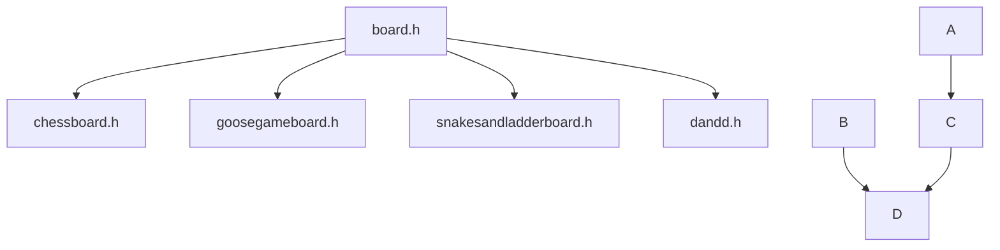

# the_grandmaster_idea

### Study the mathematics of a complex system par excellence and try to apply to these results the concepts already widely used in mathematics such as the entropy of a function h[f] (also used in theoretical physics for black holes at the beginning of history) in search of a fundamental axiom from which to coherently build general relativity and quantum field theory.
The game of chess is probably one of the most complex board games to describe mathematically and with an enormous number of possible combinations. Grandmaster is the highest title a chess player can attain and this project bears his name.

# What is the_grandmaster_idea
the_grandmaster_idea is a simulation software to explore the deep structure of board games

# Source code
To compile source code with g++
```
git submodule update --init --recursive
g++ the_grandmaster_idea.cpp -o the_grandmaster_idea -O3 -Wall
```
The source code allows you to measure a lot of properties of chess games, in particular
* number of moves per game
* save every game (see game compression system)
* number of pieces for each moment of the game
* number of pieces captured from each piece
* average number of positions available for each piece
* average number of pieces that can be captured for each piece

# Game compression system
When each game is saved, strings are stored on a file. At first it is saved the starting position of a piece (6 bits), the arrival position (6 bits) and any modification of the piece in the case of pawns reaching the other side of the chessboard (2 bits).
Suppose following movements: a white pawn on A4 is put on A5 and then a black knight on G6 is put on E5. Starting from cell A1 (index 0), A4 has index 24, A5 has index 32, G6 has index 46 and E5 has index 36.
|   meaning    | unused | white from | unused | white to | unused | black from | unused | black to |
| :----------: | :----: | :--------: | :----: | :------: | :----: | :--------: | :----: | :------: |
|  positions   |        |     A4     |        |    A5    |        |     G6     |        |    E5    |
|   indexes    |        |     24     |        |    32    |        |     46     |        |    36    |
| binary value |   00   |   011000   |   00   |  100000  |   00   |   101110   |   00   |  100100  |

|        meaning         | white from | white to | black from | black to |
| :--------------------: | :--------: | :------: | :--------: | :------: |
| formatted binary value |  00011000  | 00100000 |  00101110  | 00100100 |
|         value          |     24     |    32    |     46     |    36    |
|        value+32        |     56     |    64    |     78     |    98    |
|      ascii symbol      |     8      |    @     |     N      |    b     |

Hence the information: white pawn A4->A5 and black knight G6->E5 is stored inside the string '8@Nb'.

# Performance
The average duration of a single board::play_random() in µs is considered an index of the goodness of the code
|time|CPU|duration (µs)|time for 10⁹ plays (hours)|
|:-:|:-:|:-:|:-:|
|18 november 2022|Intel(R) Core(TM) i7-8565U CPU|33.106|9|
|14 november 2022|Intel(R) Core(TM) i7-8565U CPU|232.106|64|
|9 november 2022|Intel(R) Core(TM) i7-8565U CPU|267.363|74|
|15 september 2022|Intel(R) Core(TM) i7-8565U CPU|478.519|133|

<!--## Results-->
<!--Several GB of data are available relating to simulations and tests carried out on millions of games-->
<!--* Duration: each row represents the number of moves per game (1 for white, 2 for black, 3 for white next move, 4 for black next move, ...). https://mega.nz/folder/Ofgy2DSY#QToVcF2i09a-s8eMzzkndA-->
<!--* History: history of all the moves for each game. https://mega.nz/folder/nfYVlKzR#rEgiPNBkVk5UxyZfWUkq0g-->

# Call for results
Anyone can contribute to the search for new games to always produce new results and deepen the search. Before proceeding to upload the files make sure that the -3 test is successfully passed so that no duplicate games are uploaded. If successful, you can make a pull request to main with the number of games calculated and the link from which I can download the .chess file (or files) to add to the archive.

# Class structure
The code structure is very simple


# A bit of history
This project started a long time ago. The initial inspiration came from reading a scientific article by Stephen Hawking and Roger Penrose about the thermodynamics of black holes and the definition of a black hole's entropy. Quantum theory and quantum gravity, in particular, hypothesize the existence of infinite infinitesimal bits of information that interacting with each other allow the universe to exist as we know it (if we really know it). In any case, the concept of entropy and all the thermodynamics of black holes is based on this hypothesis even at the moment it is completely indemonstrable with current technology. However, extensive research has led me to think that the same models and definitions of entropy can be used to study complex systems on a large scale.
It is very interesting to note that Hilbert's sixth problem, in a sense, aims at the same goal: to axiomatize the areas of physics in which mathematics is prevalent. It is precisely the quantum theory of fields and general relativity that seem, at the moment, irreconcilable but both are based on solid mathematical foundations and would be impossible to describe without the use of particular mathematical tools such as operators and tensors.
Now, perhaps, the project will appear clearer: study the mathematics of a complex system par excellence and try to apply to these results the concepts already widely used in mathematics such as the entropy of a function (also used in theoretical physics for black holes at the beginning of history) in search of a fundamental axiom from which to coherently build general relativity and quantum field theory.